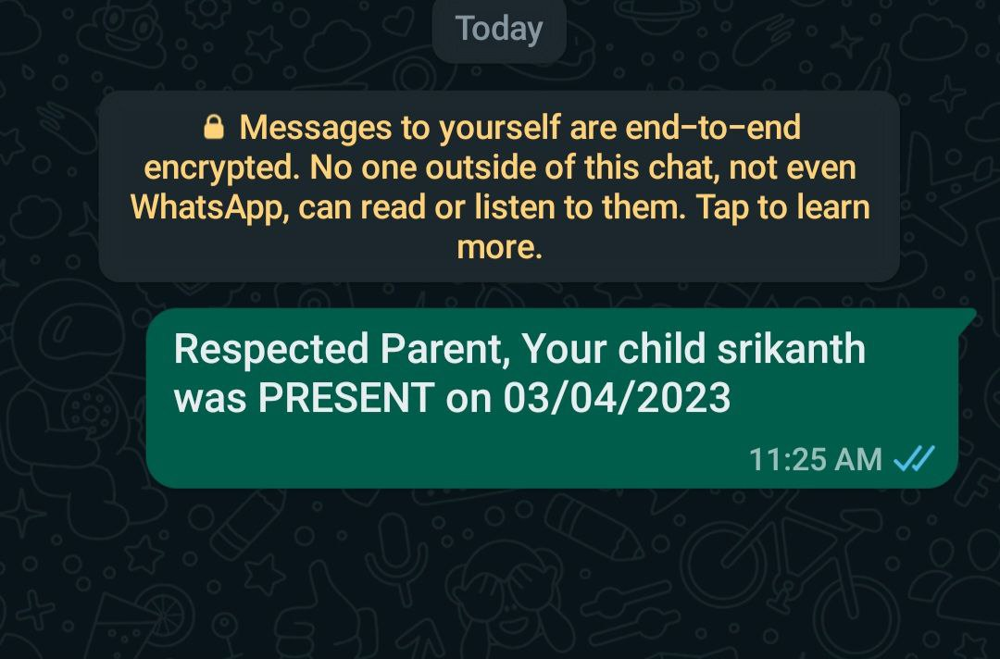
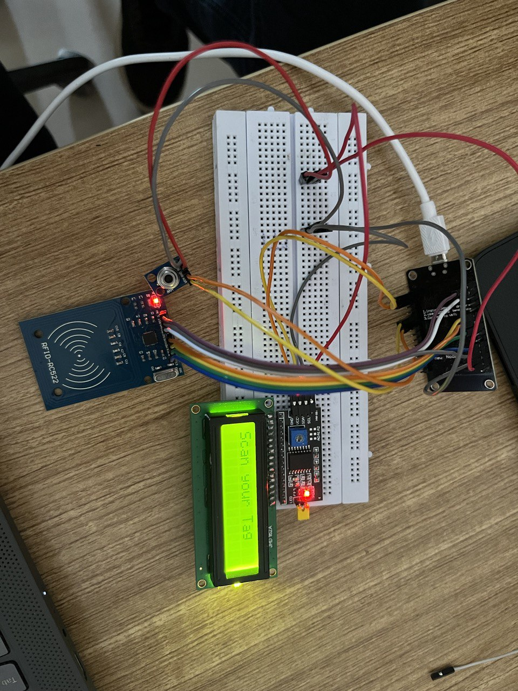

# RFID-Based Attendance Monitoring System

This is a smart RFID-based attendance system designed for schools, colleges, or workspaces. It automates attendance logging and can optionally notify parents or administrators via WhatsApp using Google Sheets scripting.

---

## 💡 Project Overview

When a user taps their RFID tag, the system:

- Reads the RFID data using the RC522 sensor
- Logs the ID and timestamp to a linked Google Sheet
- Uses Google Apps Script to trigger an automated message (e.g., WhatsApp) to guardians or authorities

This solution replaces manual registers with contactless logging and real-time updates.

---

**Components Used:**

- Arduino Uno / Nano  
- ESP8266WiFi
- RC522 RFID Module  
- 16x2 LCD Display with I2C  
- Buzzer (optional)  
- Breadboard & jumper wires  
- USB cable for power & programming

---

## 🔧 How It Works

1. **RFID Detection:**  
   Every time an RFID tag is scanned, its UID is captured and matched to a user.

2. **Google Sheets Logging:**  
   The Arduino sends data to a Google Sheet (via serial or ESP module, depending on expansion).  
   In your implementation, you manually triggered a `Google Apps Script` which logs attendance.

3. **Optional WhatsApp Notification:**  
   A simple Apps Script function on a button click sends a WhatsApp message like:  
   _"Respected Parent,Your child [Name] was present on[Time]."_
    

---

## 🚀 Future Improvements

- Integrate ESP8266 for wireless auto-logging  
- Replace WhatsApp button with auto-trigger  
- Add OTP verification for leave requests  
- Use face recognition as a fallback

---

## 📷 Demo Image

---

